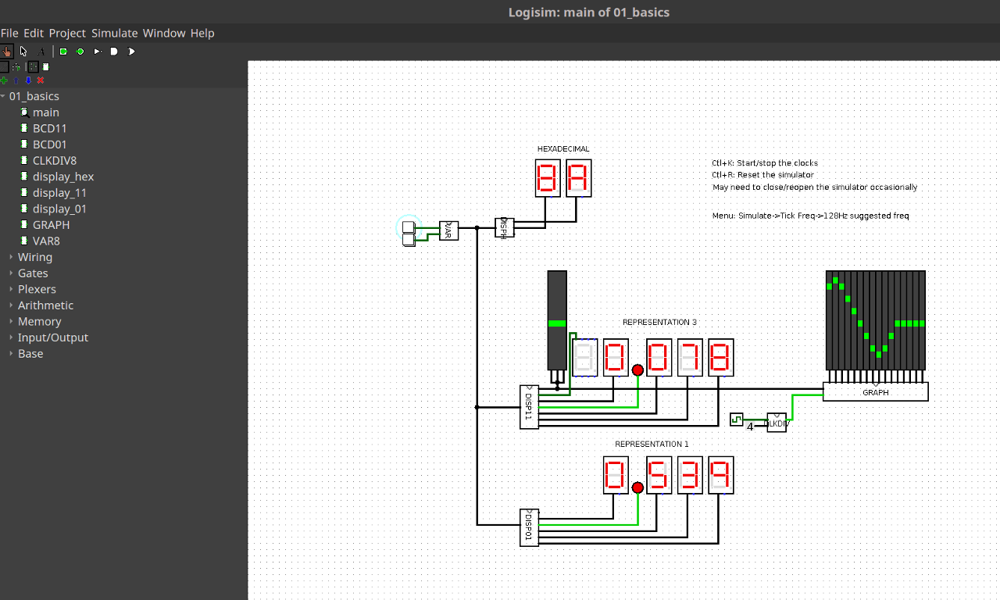

# Stochastic bitstream computing

Most of the elements are based on [this PDF excerpt](http://pages.cpsc.ucalgary.ca/~gaines/reports/COMP/SCS69/SCS69.pdf)
titled "Stochastic Computing Systems" by B. R. Gaines. There is a broader field
of stochastic computing than that described by Gaines, and so I am calling this
approach "stochastic bitstream computing." There is also a form of computing
termed "bitstream computing" which does not necessarily utilize stochasticity.

This repository contains [Logisim](http://www.cburch.com/logisim/) files.

You can run Logisim on Windows or Linux systems by installing a Java runtime.
Download and run the Logisim installer for your OS and everything should just
work. Unfortunately, Logisim is no longer being maintained so if you have an
issue, there may be no solution. In the future, I plan to port to Verilog so
these elements can be built with standard EDA tools.

Note that if you want to copy objects from one Logisim file to another, you
need to use the "File->Open" menu from within Logisim. If you double-click the
.circ files from your file explorer, you will not be able to copy and paste
objects between the files.

Gaines describes three stochastic representations. Most of the SBC elements
I've built so far operate on representation I. But I plan to implement some
elements based on representation III (this will facilitate differentials).
Representation II is of limited interest. By and large, the counter elements
are 8-bit (saturating). I am also building some 16-bit elements for handling
higher resolution.

I plan to add a description for each Logisim file as I publish it.

01_basics.circ
--------------

This file introduces the inputs and outputs for the SBC circuits we will build.
It introduces the VAR element which can be used to drive an 8-bit value. To
increase the output value of the VAR element, click the upper button. To
decrease it, click the lower button.

Note: You must press Ctl+K to start the clocks before the counters will respond
to button-presses. Also, you may need to press Ctl+1 (numeric) to manipulate
the buttons.

It introduces the DISPH element which can drive two 7-segment displays showing
an 8-bit hex value.

It introduces the DISP11 element which can drive 7-segment displays and an
LED-matrix showing the Representation III value (which ranges from -1 to 1) of
an 8-bit counter input.

It introduces the DISP01 element which is just like the DISP11 element except
that it is based on Representation I which ranges from 0 to 1.

It introduces the GRAPH element which can visually track the level of an 8-bit
value over time.

Note: The graphical elements only have 16 LEDs so they are only using the
upper hex digit of the 8-bit value and throwing away the lower hex digits.
Practically, this means you will click VAR sixteen times in one direction
before you see a visual change on the LEDs.

02_DSC.circ
-----------

This file introduces the Digital-to-Stochastic converter or DSC. The DSC allows
you to generate a stochastic signal from an 8-bit digital value. When the value
on the 7-segment displays is 0.000, the graph will stay blank. But when you
increase the value of VAR to some non-zero value, you will start to see green
dots showing up on the graph.

If you set VAR to 0.500, you will see that about 50% of the columns have a
green dot and 50% do not, at any given time. But the pattern is random and this
is what makes the signal *stochastic*. It is a single bit line carrying a 1
about 50% of the time when the 8-bit input of the DSC is 0x80 (the display will
show 0.500). If you increase VAR towards 1, a larger and larger percentage of
the columns will have a green dot. And so on. The DSC element is a convenient
way to generate stochastic input signals to a stochastic circuit.

You will also notice the D8RNG element. This element is just a random noise
source. Some of the elements require a random noise source in order to
function. These elements will have an input signal named "D8_RNG_IN" and a
corresponding output signal named "D8_RNG_OUT". This is a workaround for
Logisim's built-in random generators which all operate in synch, that is, they
all output the *same* random value. It is essential for stochastic bitstream
circuits that all random numbers in the system must be completely
un-correlated. The D8RNG signal adds some extra wires to the circuits but they
can be ignored for the purposes of understanding the function of the circuit.

03_ADDIE_intro.circ
-------------------

This file introduces the ADDIE which is described in Gaines. It stands for
"ADaptive DIgital Element". The ADDIE allows us to convert a stochastic signal
back to digital form, among other things.

To see how the ADDIE works, set VAR to some desired value as shown on the
7-segment displays. You will notice that the display connected to D8_OUT signal
from the ADDIE will begin to change to match the value you have assigned to
VAR. However, the input to the ADDIE is stochastic, so the resulting output of
the ADDIE is also stochastic -- the value of the output will vary slightly in
respect to the reference value of VAR. This might seem like a bug but it
illustrates the essential feature of stochastic bitstream computing. The random
"jitter" induced by the stochastic elements is actually a very useful property
because it will allow us to de-correlate signals in the circuit.

04_stochastic_complement.circ
-----------------------------

This file introduces one of simplest SBC operations: complement. The complement
of a stochastic bitstream is created by passing it through a NOT-gate. In the
file, there are four displays:

    [VAR]       [VAR']

    [P]         [P']

The prime (') means "complement". VAR and VAR' can be controlled using the
buttons. P is a stochastic variable that trends to VAR. And P' is a stochastic
variable that trends to VAR'. Here are the arithmetic relationships between
them:

    VAR'  = 0.996 - VAR

      P'  = 1 - P

      P  ~= VAR

      P' ~= VAR'

Where `~=` should be read "approximately equal". By adjusting the value of VAR
and comparing the displays, you can see how the stochastic variables respond to
changes of VAR. While this is only a very simple arithmetic example, it serves
to illustrate the overall behavior of stochastic variables in a stochastic
bitstream circuit. In general, we cannot neglect time-delays so we have to
analyze the steady-state behavior of the circuit to understand how it will
behave.

Stay tuned...

